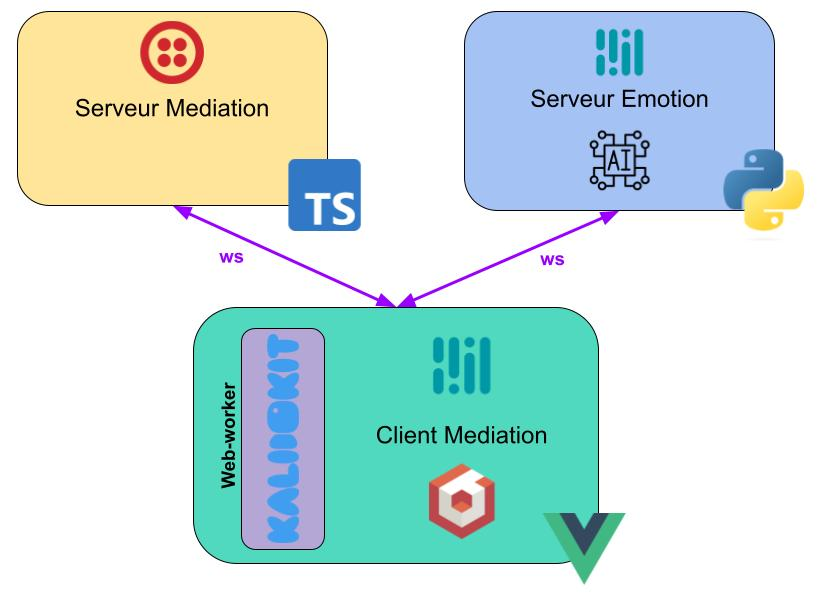

# Mediation 3D Client

## Requirement

- [Node.js](https://nodejs.org/)
- [npm](https://www.npmjs.com/)
- [twilio account](https://www.twilio.com/)
- [Server project](https://github.com/Mediation3D/Server-Mediation)
- (Optional) [Server Emotion project](https://github.com/Mediation3D/Server-Mediation)

## Installation

1. clone Github repository : `git clone https://github.com/Mediation3D/Client-Mediation.git`
2. install npm dependency : `npm i` (if you use **yarn** : `yarn`)
3. copy & rename **.env.template** into **.env**, then complete with your twilio API data
4. start project (dev mode) : `npm run dev`

for more details look [Vue.js documentation](https://vuejs.org/guide/introduction.html)

## Architecture

### Technologies

**Languages & Frameworks**
- [TypeScript](https://www.typescriptlang.org/)
- [Vue.js](https://vuejs.org/)
- [Python](https://www.python.org/)

**Libraries/packages**
- [Mediapipe](https://developers.google.com/mediapipe)
- [Babylon.js](https://www.babylonjs.com/)
- [Twilio](https://www.twilio.com/)
- [Kalidokit](https://github.com/yeemachine/kalidokit)